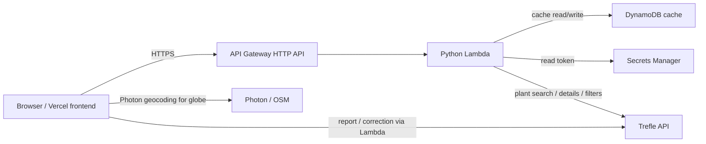

# PlantDex Design Document

## Overview

PlantDex is a plant discovery website: an online index and UI layer over the [Trefle](https://trefle.io) plant API. It helps users search for familiar plants and explore related species, lesser-known relatives, and similar plants through taxonomy and trait-based discovery.

Instead of identifying a plant from a photo or managing a personal garden list, PlantDex focuses on botanical context. For example, searching “blueberry” can surface bilberries, lingonberries, cranberries, and other plants in the *Vaccinium* genus or Ericaceae family.

This is not primarily a machine learning project. The product is a read-mostly discovery interface: search, profiles, related plants, compare, distribution visualization, and lightweight tooling to report or correct upstream Trefle data.

## Customer Identification & Problem Statement

The target users are gardeners, students, plant hobbyists, educators, and curious users who want to learn more about plants beyond a single common name. Many people know broad plant names like “blueberry,” “maple,” or “monstera,” but they may not realize that each name can refer to many species, cultivars, or related plants. This is especially clear with rare species and translated common names that map to related but non-identical species (e.g. custard apple — *Annona reticulata* vs sugar apple — *Annona squamosa*).

Existing plant tools often focus on image identification, care reminders, or shopping. They usually do not make it easy to explore botanical relationships in an accessible way. Users want answers like: What species are related to this plant? Are there lesser-known edible relatives? What shares this genus, family, or fruit color? How do similar plants compare?

A successful outcome is a deployed website where users can search a plant, open a rich profile, discover related plants, compare them side by side, and optionally contribute corrections back to Trefle.

## Background Research and Related Work

Related tools and concepts include:

- Trefle API for plant taxonomy and metadata
- USDA PLANTS Database, GBIF, and iNaturalist-style biodiversity databases
- Plant identification apps such as PictureThis or PlantNet
- Rule-based recommendation / similarity systems based on metadata matching

PlantDex differs by treating Trefle as the source of truth and providing a polished discovery UX on top of it, rather than building a social save/collections product or a diagnostic app.

## Goals

1. Allow users to search for plants by common or scientific name.
2. Display plant results as clean image cards with names and key metadata.
3. Provide detailed plant profile pages with taxonomy, traits, distribution, and a native-range globe when data exists.
4. Recommend related plants using taxonomy and metadata-based similarity (genus, family, distribution, edible part, growth habit, fruit color, etc.).
5. Let users compare 2–4 plants side by side.
6. Cache Trefle responses to reduce repeated external API calls.
7. Deploy the backend on AWS and the frontend on Vercel.
8. Allow users to report errors or submit corrections to Trefle through PlantDex (token stays server-side).

## Non-Goals

PlantDex deliberately does **not** include:

1. User accounts, authentication, or personal plant collections.
2. Guaranteed local growing recommendations by ZIP code.
3. Cultivar recommendations for a user’s climate.
4. Disease diagnosis or computer-vision identification.
5. Professional agricultural or horticultural advice.
6. Marketplace / nursery inventory.
7. Training a custom machine learning model.
8. Fully verifying all Trefle data manually.

Collections and auth were considered in an earlier draft and rejected: the practical value of PlantDex is discovery indexing over Trefle, not becoming an active save/social product.

## System Architecture



- **Frontend (Next.js on Vercel):** search UI, plant profiles, related-plant sections, compare tray/page, distribution globe, about/architecture page, Trefle feedback forms.
- **Backend (AWS):** API Gateway → Lambda handlers in `src/`. Secrets Manager holds the Trefle token. DynamoDB caches search/profile/similar responses with TTL.
- **External:** Trefle for plant data; Photon (OpenStreetMap) for geocoding native-range place names on the globe.

## Data Sources

The primary data source is the Trefle API (common names, scientific names, taxonomy, images, distribution, growth traits). PlantDex does not maintain its own botanical database beyond short-lived API response caches.

Cached responses in DynamoDB are keyed by request shape (e.g. search query, plant slug, similarity basis) and expire via TTL.

Known data issues: missing images, incomplete traits, inconsistent common names, Trefle typos, and limited cultivar-level data. The UI uses fallbacks, null-safe rendering, disclaimers, and Trefle report/correction flows.

## PlantDex Backend API

Base URL is the deployed API Gateway endpoint (`NEXT_PUBLIC_PLANTDEX_API_URL` on the frontend).

| Method | Path | Purpose |
|---|---|---|
| `GET` | `/search` | Search plants by query |
| `GET` | `/plants/{slug}` | Full plant profile |
| `GET` | `/similar` | Related plants by basis |
| `POST` | `/plants/{slug}/report` | Proxy error report to Trefle |
| `POST` | `/plants/{slug}/corrections` | Proxy field correction to Trefle |

### `GET /search`

Query params: `query` (required), `max_results`, `image_only`.

Returns normalized plant cards: `id`, `slug`, `common_name`, `scientific_name`, `genus`, `family`, `image_url`, plus `count`, `warnings`, and cache metadata.

### `GET /plants/{slug}`

Returns `{ slug, plant, warnings, cache }` where `plant` includes taxonomy, traits (`flower`, `foliage`, `fruit_or_seed`, `specifications`, `growth`), distribution, and a `raw` Trefle payload for richer UI fields.

### `GET /similar`

Query params: `query`, `basis` (`genus` \| `family` \| `distribution` \| `edible_part` \| `growth_habit` \| `growth_form` \| `fruit_color` \| `bundle`), `max_results`, `image_only`.

Returns related plant cards, warnings when a trait is missing, timing, and cache metadata.

### `POST /plants/{slug}/report`

Body: `{ notes, species_id? }`. Proxies to Trefle’s species report endpoint using the server-side token.

### `POST /plants/{slug}/corrections`

Body: `{ notes?, source_type, source_reference, correction, species_id? }`. Proxies to Trefle’s species correction endpoint with an allowlisted set of fields.

## Execution Flow

1. User visits PlantDex (Vercel).
2. User searches for a plant (e.g. “blueberry”).
3. Frontend calls `GET /search`.
4. Lambda checks DynamoDB cache; on miss, calls Trefle, normalizes cards, caches, returns results.
5. User opens a profile → `GET /plants/{slug}`.
6. Profile shows overview traits, distribution chips, native-range globe (Photon geocoding), and related-plant sections via multiple `GET /similar` calls (client-limited concurrency).
7. User may add plants to a local compare tray (browser storage only — not an account collection) and open `/compare`.
8. User may report an error or submit a correction; Lambda forwards to Trefle without exposing the API token.

## Security and Configuration

```env
# Backend / Lambda
TREFLE_TOKEN=...                    # local only
TREFLE_SECRET_NAME=plantdex/trefle-token
CACHE_TABLE_NAME=...

# Frontend
NEXT_PUBLIC_PLANTDEX_API_URL=https://....execute-api.us-west-2.amazonaws.com
```

Practices:

- Keep the Trefle token in AWS Secrets Manager; never ship it to the browser.
- Proxy Trefle writes (report/correction) through Lambda.
- Validate inputs and allowlist correction fields.
- Cache repeated reads; limit concurrent `/similar` requests from the client.
- Use SSO for AWS ops (`aws sso login --profile plantdex`).

## Risks and Mitigations

| Risk | Mitigation |
|---|---|
| Trefle data incomplete or wrong | Fallback UI, disclaimer, report/correction forms |
| Trefle rate limits / latency | DynamoDB cache, Lambda timeout headroom, client concurrency limits + retries |
| Vague searches (“berry”, “tree”) | Ranked results, example queries, clear common vs scientific names |
| API key exposure | Backend-only Trefle calls; Secrets Manager |
| Scope creep into auth/collections/climate tools | Explicit non-goals; stay a discovery UI over Trefle |

## Rollout Plan

### Phase 1 — Search and profiles ✅

Frontend search + plant profiles; backend Trefle integration; DynamoDB caching.

### Phase 2 — Related plant discovery ✅

Similarity by genus, family, distribution, edible part, growth habit/form, fruit color.

### Phase 3 — Compare ✅

Select 2–4 plants and compare taxonomy/traits side by side (local tray; no accounts).

### Phase 4 — Cloud deployment

- Backend: AWS Lambda + API Gateway + Secrets Manager + DynamoDB
- Frontend: Vercel
- About/architecture page documenting the system and APIs

### Phase 5 — Future extensions (optional)

Curated discovery paths, stronger filters/autocomplete, richer maps, AI-generated explanations — still without requiring user accounts unless a future product decision revisits that explicitly.
